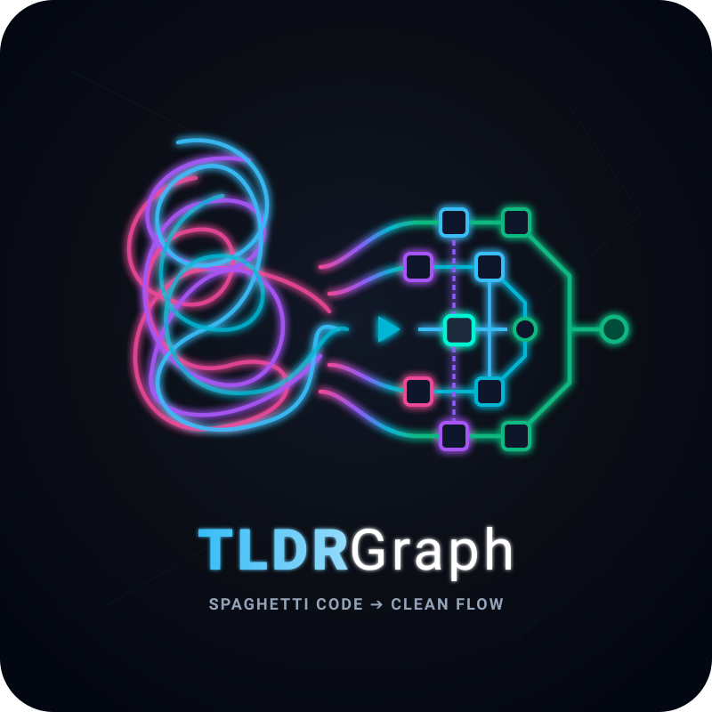

<p align="center">
  
</p>

<h1 align="center">TLDRGraph 🌐</h1>

<p align="center">
  <strong>See the flow of your spaghetti code, VibeCoders.</strong> 🍝➡️⚡<br>
  <em>Dynamic Multi-Layer Code Flow, Instant Semantic Call Tracing, and Interactive Architectural Navigation.</em>
</p>

<p align="center">
  <a href="https://pypi.org/project/tldrgraph/"></a>
  <a href="https://pypi.org/project/tldrgraph/"></a>
  <a href="LICENSE"></a>
  <a href="https://github.com/safishamsi/graphify"></a>
</p>

---

## 💡 What is TLDRGraph?

Modern codebases are messy. Microservices, multi-layer abstractions, dynamic API routes, and ORM calls create cognitive overload.

**TLDRGraph** cuts through the noise. It dynamically classifies your repository into tailored architectural layers, extracts cross-layer execution seams, tracks changes using zero-token SHA-256 hash gating, and provides both **CLI flow tables** and a **lightning-fast standalone visualizer**.

---

## 🏛️ Dynamic Architectural Layers

Rather than forcing every project into a rigid model, TLDRGraph automatically detects your codebase archetype or synthesizes dynamic architectural layers directly into `.tldrgraph/layers.config.yaml`:

- **Full-Stack Web:** Presentation & UI $\rightarrow$ API Gateway $\rightarrow$ Domain Services $\rightarrow$ Data & Persistence $\rightarrow$ Async Tasks $\rightarrow$ DevOps
- **Backend APIs:** API & Handlers $\rightarrow$ Domain Services $\rightarrow$ Persistence & Repositories $\rightarrow$ Background Jobs $\rightarrow$ Utilities
- **CLI Applications:** CLI & Commands $\rightarrow$ Core Flow Engine $\rightarrow$ Storage & Index $\rightarrow$ Agent Loop & UI $\rightarrow$ Utilities
- **Libraries & SDKs:** Public API $\rightarrow$ Core Engine $\rightarrow$ Types & Models $\rightarrow$ Adapters $\rightarrow$ Utilities

---

## 🚀 Quickstart

### 1. Install TLDRGraph
```bash
pip install tldrgraph
```
*(For optional local ONNX neural embeddings: `pip install "tldrgraph[embeddings]"`)*

### 2. Scan & Classify Repository
```bash
tldrgraph scan .
```
This runs Graphify AST extraction, classifies architectural layers, builds offline local search indices, and creates `.tldrgraph/layers.yaml`.

### 3. Explore the Architecture Visually
```bash
tldrgraph ui --serve
```
Opens the interactive canvas:
- **Modules overview** at low zoom.
- **Symbol details** (classes, methods, inputs, outputs) as you zoom in.
- **Click-to-isolate** focused nodes with upstream callers and downstream callees.
- **Live source viewing** on demand with zero static HTML bloat.
- **⚠️ Dead Nodes filter** to immediately isolate unreferenced candidate symbols.

### 4. Query Execution Flows
```bash
tldrgraph query "pension application approval flow"
```
Outputs readable Markdown execution flow tables tracing the request across UI, API, Service, and DB layers.

### 5. Trace Exact Call Paths
```bash
tldrgraph trace "ApplicationsController" "JhPensionApplication"
```

### 6. Review Dead Code & Reachability
```bash
tldrgraph dead-code
```
Surfaces orphaned components, unreferenced models, and unused files for human review.

---

## 🤖 AI Assistant Rules (`tldrgraph install`)

TLDRGraph supports seamless pairing with AI coding assistants (Claude Code, Cursor, and Antigravity):

```bash
tldrgraph install
```

Automatically writes agent instructions pointing to `.tldrgraph/AGENT_CONTRACT.md`:
- `.claude/skills/tldrgraph/SKILL.md` + delimited section in `CLAUDE.md` (Claude Code)
- `.cursor/rules/tldrgraph.mdc` (Cursor)
- `.agents/rules/tldrgraph.md` (Antigravity)

---

## 📁 Artifacts & Output Formats

All project state is kept in `.tldrgraph/` (with automatic fallback to `.codechakra/`):
- `.tldrgraph/graph.json` : Persisted multi-layer graph snapshot with cross-layer edges.
- `.tldrgraph/layers.yaml`: Layer distribution and node definitions.
- `.tldrgraph/flows.yaml` : Exported trace paths.
- `.tldrgraph/tldrgraph.db`: Local SQLite content-hash cache for zero-token incremental updates.
- `.tldrgraph/TLDRGRAPH_VISUALIZER.html`: Standalone zero-dependency visualizer.

---

## 🙏 Acknowledgements & Upstream Credits

TLDRGraph is built on the shoulders of giants. Sincere credit and special thanks to:
- **[Graphify](https://github.com/safishamsi/graphify)** by [Safi Shamsi](https://github.com/safishamsi) — for the AST parsing and knowledge graph extraction foundation.

---

## 📄 License

Distributed under the [MIT License](LICENSE).
