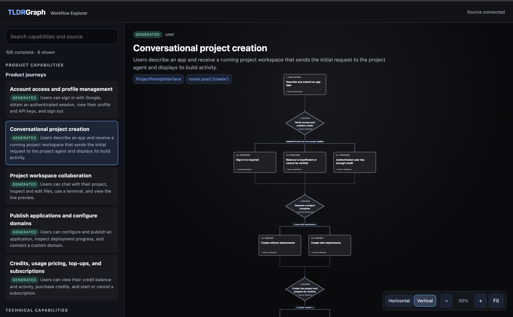

<p align="center">
  
</p>

<h1 align="center">TLDRGraph 🌐</h1>

<p align="center">
  <strong>Turn a codebase into source-backed feature workflows.</strong><br>
  <em>Explore what the software does, follow every decision, and open the code that proves it.</em>
</p>

<p align="center">
  <a href="https://pypi.org/project/tldrgraph/"></a>
  <a href="https://pypi.org/project/tldrgraph/"></a>
  <a href="https://vikrantd.github.io/TLDRGraph/"></a>
  <a href="LICENSE"></a>
</p>

---

## ✨ See the workflow, then see the proof

TLDRGraph turns a repository into a catalog of meaningful product and technical
capabilities. For each feature, your coding agent records an evidence-backed
workflow: every displayed step cites the exact file, symbol, and line range that
supports it.

It does not invent an architecture from a static graph or run an AI process by
itself. Instead, it gives the coding agent already working in your repository a
small, verifiable artifact format to complete.

## 🗺️ Workflow Explorer

Browse the capability catalog, select a workflow, and inspect the source
evidence behind each part of the flow. The standalone explorer supports:

- Product and technical capability areas, with generated, partial, and pending states.
- Vertical workflow diagrams with process steps, decision diamonds, labeled branches, and reconvergence.
- Panning, zooming, and an optional horizontal layout.
- A detail panel for each workflow element and live cited-source viewing with `tldrgraph ui --serve`.
- A stale-catalog warning when the repository no longer matches the catalog's source hash.

<p align="center">
  
</p>

## 🚀 Quickstart

### 1. Install

```bash
pip install tldrgraph
```

### 2. Generate a source-backed catalog

Run TLDRGraph inside a supported coding-agent session:

```bash
tldrgraph init
```

If the command reports `needs_feature_workflows`, it prints the current source
hash. The active agent then reads the repository, identifies feature outcomes,
and writes the catalog index. A source-reading worker produces each feature's
workflow with evidence. Run `tldrgraph init` again to validate those artifacts
and generate the explorer.

### 3. Explore the result

```bash
tldrgraph ui --serve
```

The generated browser application lets you navigate workflows and open their
cited source ranges. After the repository changes, use `tldrgraph refresh` to
validate an updated catalog against the new source hash.

## 📦 What TLDRGraph creates

```text
.tldrgraph/
├── features.yaml                 # Feature index authored by the active agent
├── workflows/
│   └── <feature_id>.yaml         # Evidence-backed workflow per feature
└── TLDRGRAPH_VISUALIZER.html     # Standalone Workflow Explorer
```

The v4 catalog validates every referenced evidence file, symbol, and line
range against the repository inventory. Catalog and workflow source hashes must
match the current source before they are accepted as current.

## 🧰 CLI

```text
tldrgraph init [PATH] [--json]
tldrgraph refresh [PATH] [--json]
tldrgraph ui [--path PATH] [--serve] [--port PORT] [--open|--no-open]
tldrgraph install [--path PATH] [--all-agents]
```

`init` starts catalog generation, `refresh` makes a later source update
explicit, and `ui` creates the standalone explorer. `install` writes the
workflow instructions for supported coding-agent environments.

## 🤖 Built for coding-agent collaboration

TLDRGraph's role is coordination and validation: your active coding agent
reads the source and authors the catalog artifacts, while independent
source-reading workers provide feature workflows. This keeps the explorer
traceable to repository evidence instead of inferred from naming conventions or
an opaque background analysis process.

For the complete workflow and artifact contract, see the [documentation](https://vikrantd.github.io/TLDRGraph/).

## 🙏 Credits

TLDRGraph builds on the workflow knowledge captured by the coding agent working
with your repository.

## 📄 License

Distributed under the [MIT License](LICENSE).
