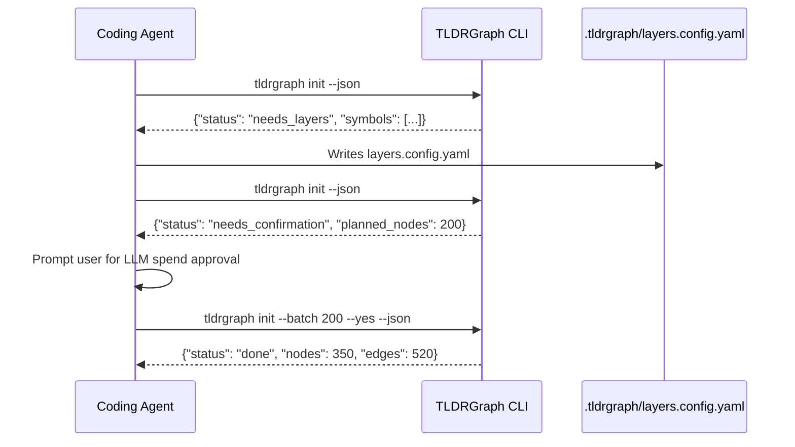

# Agent Contract Specification

TLDRGraph defines a formal request/response contract in `.tldrgraph/AGENT_CONTRACT.md`. This schema governs how agents interact with TLDRGraph in non-interactive or batch environments.

---

## The Contract Workflow



---

## Contract States & Payloads

### 1. `needs_layers`
Returned when `.tldrgraph/layers.config.yaml` is absent.

```json
{
  "status": "needs_layers",
  "reason": "Repository-specific architectural layers must be designed.",
  "extracted_symbols_count": 420,
  "top_directories": ["src/api", "src/services", "src/models"],
  "next_action": "Read repository symbols and create .tldrgraph/layers.config.yaml"
}
```

### 2. `needs_confirmation`
Returned before the agent begins spending tokens on LLM summaries.

```json
{
  "status": "needs_confirmation",
  "total_nodes": 350,
  "candidates_count": 180,
  "planned_this_run": 180,
  "batch_size": 200,
  "agent_rounds": 1,
  "next_action": "Ask user: 'TLDRGraph needs to enrich 180 architectural bottleneck symbols across 1 agent round. Proceed?'"
}
```

### 3. `needs_enrichment`
Returned when a batch of nodes is ready for semantic summarization.

```json
{
  "status": "needs_enrichment",
  "batch": [
    {
      "id": "tldrgraph/graph_loader.py::GraphLoader",
      "type": "class",
      "file": "tldrgraph/graph_loader.py",
      "line_start": 45,
      "line_end": 350,
      "current_intent": null
    }
  ]
}
```

### 4. `done`
Returned when extraction, layer classification, enrichment, and vector embeddings are up to date.

```json
{
  "status": "done",
  "nodes_count": 350,
  "edges_count": 520,
  "layers_count": 6,
  "embeddings_ready": true
}
```
