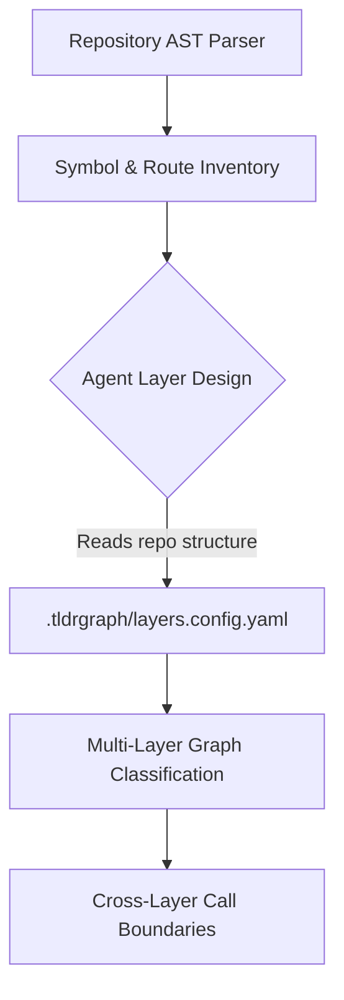

# Agent-Designed Dynamic Layers

TLDRGraph rejects one-size-fits-all architectural templates. 

Every codebase is unique: an event-driven Kafka microservice looks nothing like a Django monolith, which looks nothing like a Next.js full-stack app. Hardcoding a static "Controllers -> Services -> Repositories" layer template is wrong everywhere it looks plausible.

---

## The Philosophy: Discover, Don't Guess

When TLDRGraph runs on a fresh repository, **it ships with no layer templates**. Instead:

1. **Symbol Extraction**: TLDRGraph parses the code into functions, classes, decorators, routes, and imports.
2. **Agent Hand-off**: It hands the symbol inventory to your coding agent with architectural sketches of how different kinds of codebases can separate concerns.
3. **Agent Design**: The agent asks: *"Where does responsibility change hands in this specific codebase?"*
4. **Configuration File**: The designed layers are committed to `.tldrgraph/layers.config.yaml`.



---

## The `layers.config.yaml` Schema

Here is an example layer configuration generated by an agent for a full-stack repository:

```yaml
version: 1
layers:
  - id: 1
    name: "CLI & Agent Surface"
    description: "Command-line entry points, agent subcommands, and interactive terminal dispatch."
    patterns:
      - "tldrgraph/cli*.py"
      - "tldrgraph/agent_*.py"

  - id: 2
    name: "Pipeline & Ingestion"
    description: "Graph loader orchestration, snapshot serialization, and cache sync."
    patterns:
      - "tldrgraph/graph_loader.py"
      - "tldrgraph/snapshot_sync.py"

  - id: 3
    name: "Analysis & Extraction Engine"
    description: "AST parsing, route extraction, client call resolution, and seam detection."
    patterns:
      - "tldrgraph/extractors*.py"
      - "tldrgraph/flow_engine.py"

  - id: 4
    name: "Vector Index & Retrieval"
    description: "FastEmbed ONNX dense embeddings, TF-IDF lexical search, and vector storage."
    patterns:
      - "tldrgraph/vector_*.py"
      - "tldrgraph/dense_embedder.py"

  - id: 5
    name: "Visualization & Web UI"
    description: "Browser canvas rendering, color palettes, and interactive workflow assembly."
    patterns:
      - "tldrgraph/visualizer/**"

  - id: 6
    name: "Core Types & Utilities"
    description: "Path utilities, schema models, and shared helpers."
    patterns:
      - "tldrgraph/paths.py"
      - "tldrgraph/labels.py"
```

---

## Why Dynamic Layers Matter

- **Cognitive Clarity**: Grouping hundreds of files into 4–7 coherent layers prevents mental overload.
- **Architectural Guardrails**: Identifies unintended backward dependencies (e.g. database models importing UI views).
- **Accurate Flow Slices**: Enables retrieval algorithms to extract complete cross-layer execution slices from entry point to database.
