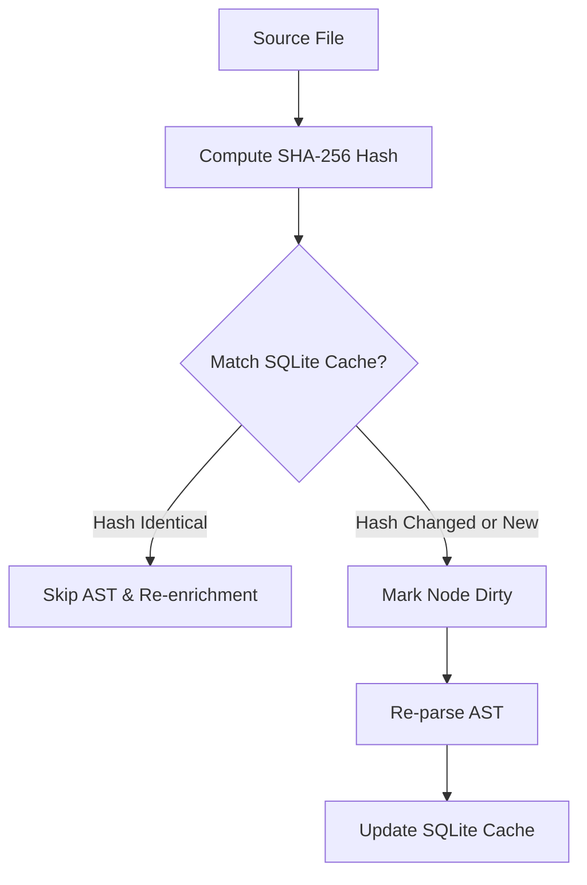

# Zero-Token SHA-256 Hash Gating

AI code indexing tools often waste thousands of tokens re-analyzing files that haven't changed.

TLDRGraph solves this with a zero-token **SHA-256 hash gating system** backed by a local SQLite cache.

---

## How Hash Gating Works

1. **Content Hashing**: Every source file is fingerprinted with a SHA-256 content signature before any parsing occurs.
2. **Local Cache (`.tldrgraph/tldrgraph.db`)**: Stores file paths, last modified timestamps, AST symbol signatures, and enrichment summaries in an SQLite database.
3. **Dirty Detection**:
    - If a file's hash matches the stored signature, its existing AST nodes, intents, and embeddings are retained without modification.
    - If the hash changed, only the symbols within that specific file are marked dirty and scheduled for incremental update.

---

## Benefits

- **Token Cost Savings**: Re-running `tldrgraph init` on a 50,000-line codebase where only one file was modified spends **0 tokens** on the 49,900 unchanged lines.
- **Instant CI Scans**: Pre-commit hooks and CI runs finish in milliseconds when checking cached snapshots.
- **Persisted Summaries**: Human-approved LLM enrichments are never accidentally overwritten or lost during routine scans.
