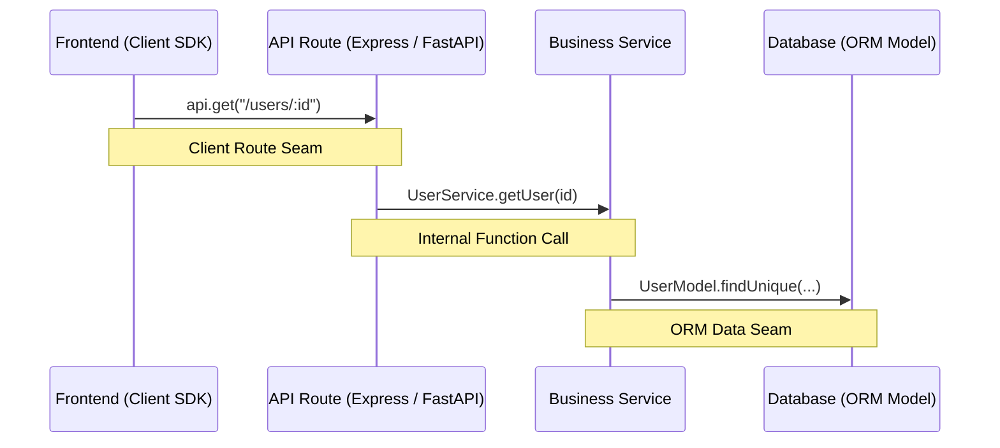

# Cross-Layer Seams & AST Route Extraction

Modern full-stack applications are glued together by dynamic boundaries: HTTP strings, RPC endpoints, client SDK calls, and ORM schema queries. Static language analyzers that only track explicit import statements miss the real cross-layer execution paths.

TLDRGraph extracts **architectural seams**—the invisible bridges connecting disparate tiers.

---

## What is an Architectural Seam?

An architectural seam represents a caller-to-callee relationship that traverses a network boundary or protocol layer:

Without seam extraction, static call graphs see two disconnected subgraphs:
1. A frontend that calls a URL string `api.get('/users/:id')`.
2. A backend that handles `@app.get('/users/{id}')`.

TLDRGraph bridges this gap deterministically using AST pattern analysis.

---

## Supported Seam Extractors

### 1. HTTP Route Handlers (`extractors_route.py`)
Identifies HTTP endpoints in backend frameworks:
- **FastAPI / Flask**: `@app.get("/api/v1/resource")`, `@router.post(...)`
- **Express / Next.js API**: `app.get('/api/users', ...)`, `export async function GET(req)`
- **Django**: `path('api/items/', ItemView.as_view())`

### 2. Client HTTP Calls (`extractors_client.py`)
Extracts frontend and client-side outgoing network requests:
- `fetch("/api/v1/resource")`
- `axios.get("/api/v1/resource")`
- `client.post(...)`

### 3. ORM & Database Seams (`extractors_prisma.py`, SQLAlchemy)
Maps domain models to database tables and query invocations:
- **Prisma**: `prisma.user.findMany(...)`
- **SQLAlchemy / Django ORM**: `User.objects.filter(...)`

---

## Seam Synthesis in the Graph

Once seams are identified:
1. Normalizes URLs (parameter placeholder normalization, e.g. `:id` $\leftrightarrow$ `{id}`).
2. Synthesizes synthetic directed edges with `relation: "calls_route"` or `relation: "queries_model"`.
3. Stores the line number and source snippet for both ends in `.tldrgraph/graph.json`.
