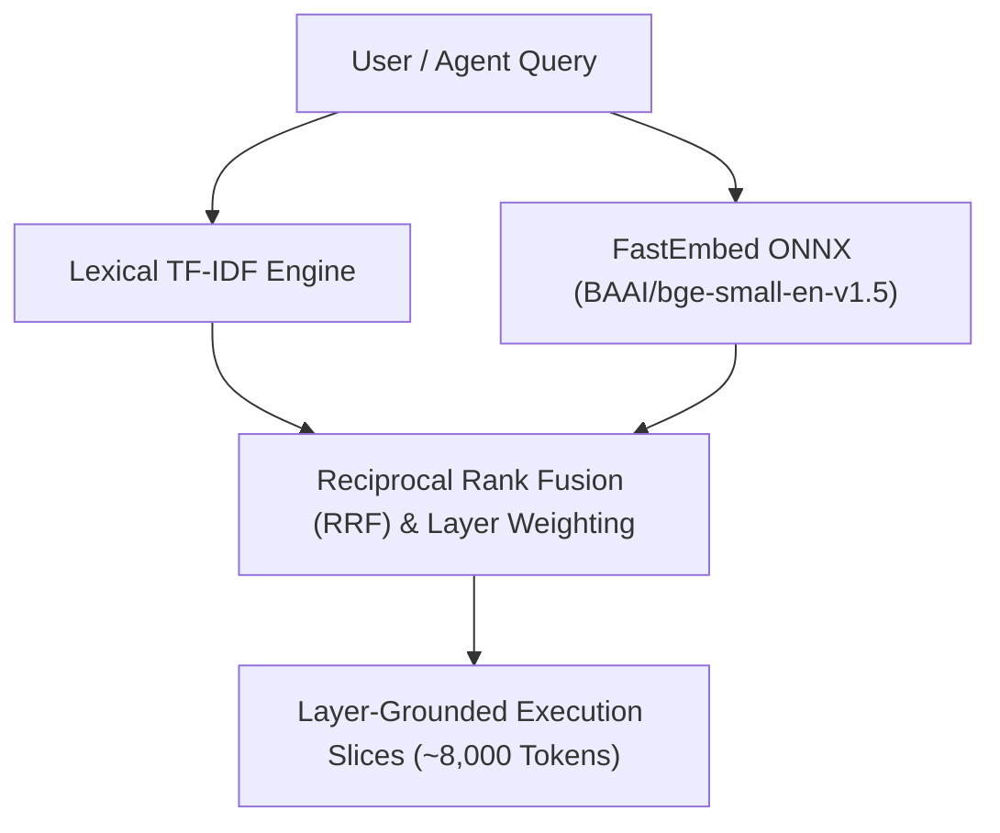

# Hybrid Vector Retrieval & Dense Embeddings

Accurate codebase retrieval requires combining two search modalities:
1. **Lexical Search (Exact Identifiers)**: Matches exact variable names, class names, method symbols, and file paths.
2. **Dense Semantic Search (Natural Language)**: Matches intent, architectural concepts, and natural language descriptions.

TLDRGraph implements a hybrid retrieval engine combining **lexical TF-IDF** with **local FastEmbed ONNX dense embeddings**.

---

## The Dual-Channel Retrieval Architecture

### 1. Lexical Search (`vector_tfidf.py`)
- Tokenizes symbols using camelCase, snake_case, and dotted package conventions.
- Weighs symbol identifiers, file path components, and docstring terms using BM25/TF-IDF scoring.

### 2. Dense Embeddings (`dense_embedder.py`)
- Employs **FastEmbed** running the optimized `BAAI/bge-small-en-v1.5` ONNX model.
- **Runs entirely locally on CPU**: Requires no GPU, no CUDA, and no PyTorch installation.
- Quantized and blazingly fast: query latency averages under 15ms.

---

## Layer-Grounded Execution Slices

Standard RAG systems blindly return chunked paragraphs from random files. 

TLDRGraph leverages its dynamic layer awareness:
- When a query retrieves a function in the business layer, it traverses the graph upwards to find the entry point route in the API layer and downwards to find the database model.
- It bundles these connected symbols into **Layer-Grounded Slices** (~8,000 tokens).
- This ensures the LLM receives the full context of how data flows across all architectural boundaries.
