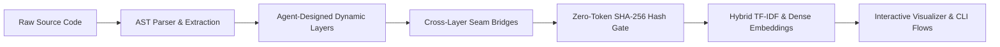

# TLDRGraph 🌐

<p align="center">
  
</p>

<p align="center">
  <strong>See the flow of your spaghetti code, VibeCoders.</strong> 🍝➡️⚡<br>
  <em>Dynamic Multi-Layer Code Flow, Instant Semantic Call Tracing, and Interactive Architectural Navigation.</em>
</p>

<p align="center">
  <a href="https://pypi.org/project/tldrgraph/"></a>
  <a href="https://pypi.org/project/tldrgraph/"></a>
  <a href="https://github.com/vikrantd/TLDRGraph/blob/main/LICENSE"></a>
  <a href="https://github.com/safishamsi/graphify"></a>
</p>

---

## 💡 What is TLDRGraph?

Modern codebases are messy. Microservices, multi-layer abstractions, dynamic API routes, and ORM calls create cognitive overload for both human developers and AI coding agents.

**TLDRGraph** cuts through the noise. It dynamically classifies your repository into tailored architectural layers, extracts cross-layer execution seams, tracks changes using zero-token SHA-256 hash gating, and provides both **CLI flow tables** and a **lightning-fast standalone visualizer**.



---

## 🗺️ Interactive Visual Navigation

TLDRGraph compiles a self-contained, zero-dependency interactive visualizer (`.tldrgraph/TLDRGRAPH_VISUALIZER.html`) that maps your entire codebase into structured architectural layers and clear end-to-end execution flows:

### 1. Architecture Map (Multi-Layer Clustered Navigation)
> *Zoom out to inspect high-level module architecture across dynamic layers; zoom in to examine function signatures, callers, and callees with cross-layer connection lines.*

<p align="center">
  
</p>

### 2. Workflows Explorer (End-to-End Execution & Decision Flows)
> *Follow step-by-step execution journeys with sequential flow lines, decision branches, participating symbols, and cross-layer transitions.*

<p align="center">
  
</p>

---

## 🏆 Key Features

- **🏛️ Agent-Designed Architecture**: Zero hardcoded templates. Your AI coding agent inspects real extracted symbols and classifies the codebase into natural layers tailored to your project.
- **⚡ 100% SWE-bench Lite Recall@10**: Outperforms Chunked Dense RAG, BM25, and Aider Repo-Map on real-world bug localization tasks while consuming up to 10× fewer context tokens.
- **🔗 Cross-Layer Seam Extraction**: Deterministically links frontend client calls (e.g. `api.get('/users')`) to backend route handlers, controller methods, and database schemas.
- **🔒 Zero-Token SHA-256 Hash Gating**: Local SQLite cache tracks file content signatures. Only dirty or newly added nodes trigger re-indexing or enrichment.
- **🔍 Fast ONNX Dense Embeddings**: Bundles local `BAAI/bge-small-en-v1.5` dense embeddings via FastEmbed, running on CPU without PyTorch or CUDA overhead.
- **🌐 Standalone Browser Visualizer**: Single-file HTML bundle with high-contrast layer palette, pan/zoom canvas, upstream caller/downstream callee graph, and live source viewer.

---

## 🚀 Quick Preview

=== "Install"

    ```bash
    pip install tldrgraph
    ```

=== "Build Graph (Agent-First)"

    ```bash
    # In Claude Code or Cursor:
    /tldrgraph-init

    # Or in Codex:
    $tldrgraph-init
    ```

=== "Query Flows"

    ```bash
    tldrgraph query "user authentication flow"
    ```

=== "Launch Visualizer"

    ```bash
    tldrgraph ui --serve
    ```
