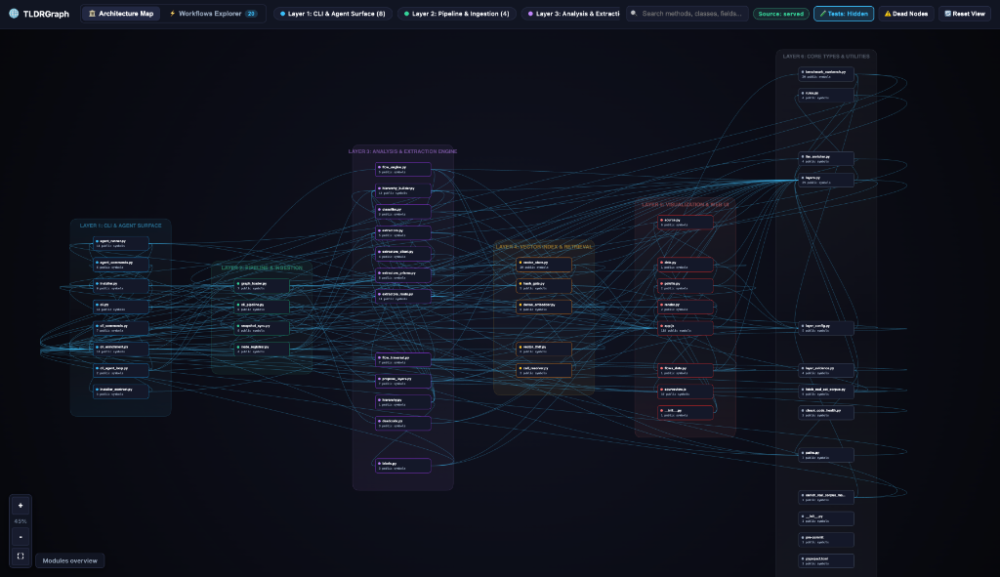

# Interactive Architecture Map

The **Architecture Map** is a clustered, multi-layer visual canvas built into TLDRGraph. It compiles into a zero-dependency HTML file (`.tldrgraph/TLDRGRAPH_VISUALIZER.html`) that can be opened in any modern browser.

  

---

## Key Capabilities

### 1. Clustered Multi-Layer Layout
- Files and modules are grouped into colored architectural columns (Layer 1 through Layer 6).
- Cross-layer connection lines show call relationships and dependencies between components.

### 2. Zoom-Driven Level of Detail (LoD)
- **Low Zoom**: Displays high-level file cards, layer boundaries, and inter-module traffic.
- **Medium Zoom**: Reveals classes, structs, and public method signatures.
- **High Zoom**: Shows method parameters, return types, docstrings, and decorator annotations.

### 3. Click-to-Isolate Focus Mode
Clicking any node instantly highlights:
- **Upstream Callers**: Highlighted in bright green or cyan.
- **Downstream Callees**: Highlighted in orange or purple.
- **Unrelated Nodes**: Dimmed to eliminate background clutter.

### 4. Live Source Viewer
When running with `tldrgraph ui --serve`, clicking **View Code** opens an embedded live file viewer:
- Reads the exact line range directly from disk.
- Zero static HTML bloat: source code is served on-demand rather than pre-inlined into massive HTML bundles.

### 5. ⚠️ Dead Nodes Filter
Click the **Dead Nodes** toggle in the top navigation bar to isolate unreferenced candidate symbols that have zero callers across the entire repository.
