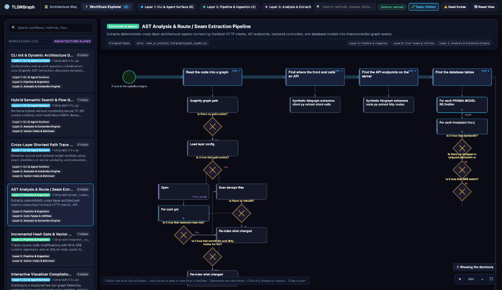

# Workflows Explorer

The **Workflows Explorer** renders end-to-end execution pipelines and decision flows on a full-width background canvas.

  

---

## What Makes Workflows Different?

While the **Architecture Map** shows static structural connections, the **Workflows Explorer** shows runtime execution order:
- Which function is invoked first?
- Where are the decision forks and validation checks?
- Which methods are called at each step?
- What database operations occur at the conclusion?

---

## Anatomy of a Workflow View

### 1. Sequential Execution Axis
- Steps are arranged chronologically along the horizontal axis.
- Blue connecting pipes guide the eye through the primary happy path.

### 2. Decision Branches (Diamonds)
- Diamond shapes indicate conditional branches (`if/else`, validations, feature flags).
- Hovering over a diamond reveals the branch condition and possible outcomes.

### 3. Participating Method Clusters
- Beneath each execution step, vertical sub-node columns display all participating methods, helper functions, and ORM operations executed during that step.

### 4. Floating HUD & Interactive Controls
- **Floating Left Sidebar**: Search workflows, filter by domain, or select a curated architectural pipeline.
- **Workflow Header Card**: Shows title, layer badges, logical step count, and entry point signature.
- **Canvas Zoom / Pan**: Smooth multi-touch trackpad and mouse wheel navigation with centering controls.
